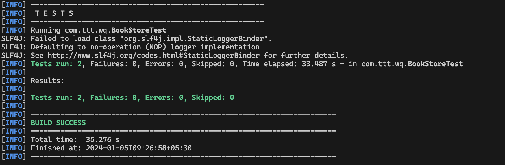
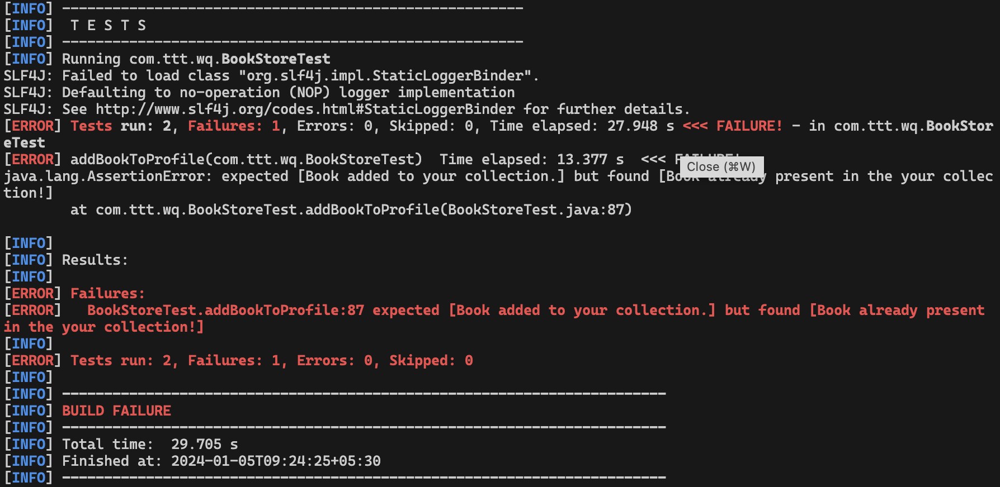

# [WQ 2024] Building Automation Framework from scratch

This project will be used to conduct live session on Framework Building in [worqference 2024](https://www.thetesttribe.com/worqference/automation-framework-workshop/)

## Installation Required

- Java `v21.0.1`
- Maven `v3.9.6`
- Editor of your choice (please resolve all editors error before the session)

### Instructor Setup

- Java `v21.0.1`
- Maven `v3.9.6`
- VSCode Editor

## Workshop Pre-requisite

- Participants should be familiar with the editor of their choice to fix issues quickly
- Participants should at-least have a basic understanding of the following:
  - Java
  - Selenium
  - Locators
  - TestNG
  - Maven
  - Git
- Complete To-Do section and make code is running without any errors

### Participants To-Do

1. Take a checkout of this repo
2. Open it in your editor
3. Run the script
4. Check output on the console, it should be one of the following:

#### Execution Success

#### Execution Failure

If you have received one of the two expected results, You're all set for the workshop, see you there! 🎉

**Please Note:** If you are not getting above results, please check if there are any installation or editor errors. Fix them and try to run the script again.

## Documentations

- [Java](https://docs.oracle.com/javase/8/docs/api/overview-summary.html)
- [Selenium](https://www.selenium.dev/documentation/)
- [TestNG](https://testng.org/doc/documentation-main.html)
- [Maven](https://maven.apache.org/guides/index.html)
- [Git](https://git-scm.com/doc)

## Post workshop

- Feel free to ask [here](https://github.com/kunalashar25/wq2024_building_automation_framework/issues/new/choose) if you have any questions or if something is unclear. 🙂

## Framework Highlights

- [Page Object Model](https://medium.com/tech-tajawal/page-object-model-pom-design-pattern-f9588630800b)
- [Driver Factory using Factory Pattern](https://refactoring.guru/design-patterns/factory-method)
- [Test specific Log Routing](https://logging.apache.org/log4j/2.x/manual/appenders.html#RoutingAppender)
- [Integrated TestNG Listeners](https://www.javatpoint.com/testng-listeners)
- [Utilizing TestNG Hooks](https://toolsqa.com/testng/testng-annotations/)
- Test Data externalization
- Environment specific configuration storage
- Segregated Environment secrets
- Parallel Test Execution on local
- [Execution Results Reporting with Allure](https://allurereport.org/docs/testng/)

## Future Enhancements

These improvements can elevate this framework to a higher level.

- [Dynamically Building TestNG.xml file](https://youtu.be/cP3HmqTAC54?si=0fu4TLx1LYy-NlkP)
- [Retrying Failed Tests](https://medium.com/@chathumalsangeeth/how-to-implement-the-testng-retry-mechanism-for-failed-test-cases-e4f600e6dc1d)
- [Test Execution History Tracking in Allure](https://allurereport.org/docs/history-and-retries/)
- [Enabling Selenium Grid for execution](https://www.selenium.dev/documentation/grid/)
- [Integrating with CI - Jenkins](https://www.softwaretestinghelp.com/integration-of-jenkins-with-selenium-webdriver/)
- [Run on Cloud - BrowserStack](https://www.browserstack.com/)
- [Making API requests w/ HttpClient](https://www.baeldung.com/java-9-http-client)
- [Externalize Test Data with @DataProviders](https://www.lambdatest.com/blog/how-to-use-dataproviders-in-testng-with-examples/)
- [Generating fake test data](https://www.baeldung.com/java-faker)
